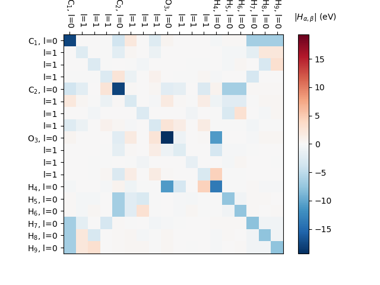

# Deep-GWBSE

Deep-GWBSE is a deep learning model designed for GW+BSE calculations. This model aims to provide accurate and efficient predictions for electronic structure calculations.

## Table of Contents
- [Introduction](#introduction)
- [Installation](#installation)
- [Usage](#usage)
- [Contributing](#contributing)
- [License](#license)

---------------------------

## Introduction
GW+BSE (Green's function and Bethe-Salpeter Equation) are advanced methods used in computational materials science to study the electronic properties of materials. Deep-GWBSE leverages deep learning techniques to enhance the accuracy and efficiency of these calculations.

---------------------------

### Idea

In $G_0W_0$, we assume $[H^{DFT}, \Sigma^{GW}]=0$, so the quasi-particle (QP) Hamiltonian reads:

$$
H^{QP} = \sum_{nk} | nk \rangle  \left( \epsilon^{DFT} + \epsilon^{G_0W_0} \right)  \langle nk |
$$

We can project the QP Hamiltonian to atomic orbital basis $| l \alpha \rangle$ as:

$$
H_{la, jb} = \sum_{nk}  \epsilon^{QP} \langle la | nk \rangle  \langle nk | jb \rangle 
$$

$$
= \sum_{nk}  \epsilon^{QP} \langle a | nk \rangle  \langle nk | b \rangle e^{ikR(l-j)}
$$

In term of tight-binding model, $H_{la, jb}$ can be understood as a hopping term between two nodes. To learn this hopping term, we can first build a graph structure on crystal system { $v_l$, $e_{lj}$ }, where node feature $v_i=0\oplus 0\oplus 0...$ embeds element information, $e_{lj}=0\oplus 1 \oplus 2...$ embeds geometry information between two nodes. Then, e3nn convolution layer can conduct message passing for this graph and map it to hopping term $H_{la, jb}=e^{L}_{lj}$, where L denotes the last layer

In principle, we can even generalize this to two-particle vertex function, such as electron-hol kernel $K_{cvk,c'v'k'}$

---

### 1. Molecule System (only $k=\Gamma$)
- **Step 1**. Build AO Hamiltonian reconstructed from PW :
(01-TBM-QPH/molecule_TBM.py is prototype)



- **Step 2**. Build Graph for Molecule Systems
Doing!

---------------------------

### Useful Reference:
Papers:
- e3nn: https://arxiv.org/abs/1802.08219
- DeepH: https://www.nature.com/articles/s43588-022-00265-6
- DeepH-e3nn: https://www.nature.com/articles/s41467-023-38468-8
- HamGNN: https://iopscience.iop.org/article/10.1088/0256-307X/41/7/077103/meta
- el-ph GNN: https://www.nature.com/articles/s43588-024-00668-7
- Planewave2Orbital: https://www.nature.com/articles/s43588-024-00701-9
- AO basis: https://journals.aps.org/prb/pdf/10.1103/PhysRevB.80.195112, 

GPAW Documents:
- LCAO Hamiltonian: https://gpaw.readthedocs.io/tutorialsexercises/localorbitals/localorbitals.html
- LCAO Calculation: https://gpaw.readthedocs.io/tutorialsexercises/structureoptimization/water/water.html#lcao-calculations,
- LCAO mode: https://gpaw.readthedocs.io/documentation/lcao/lcao.html#lcao
- Atomic Basis Set: https://gpaw.readthedocs.io/documentation/basic.html#atomic-basis-set
- "m" Order in GPAW: https://gpaw.readthedocs.io/_modules/gpaw/dos.html#

### Useful GPAW function

Hamiltonian with atomic orbitals basis (see Bezene_LCAO.py)
```python
#...calc...

# (1) LCAO Hamiltonian
from gpaw.lcao.pwf2 import LCAOwrap
lcao = LCAOwrap(calc)
H = lcao.get_hamiltonian()
S = lcao.get_overlap()

# (2) LO Hamiltonian
from gpaw.lcao.local_orbitals import LocalOrbitals
los = LocalOrbitals(calc)
los = LocalOrbitals(calc)
H = los.get_hamiltonian()
S = los.get_overlap()
```

Useful Note for LCAOwrap
```python
lcao.pwf2 (line 375): LCAOwrap.get_hamiltonian()
lcao.tools (line 283): get_lcao_hamiltonian(calc) 
```


Coefficient $\langle nk | l \alpha \rangle$

dos.py 
```python
(line 113): def raw_orbital_LDOS(paw, a, spin, angular='spdf', nbands=None)
```
The "m" order

```python
class DOSCalculator:
    ...
    def raw_pdos(self,
                 energies: Sequence[float],
                 a: int,
                 l: int,
                 m: Optional[int] = None,
                 spin: Optional[int] = None,
                 width: float = 0.1) -> Array1D:
        """Calculate projected density of states.

        a:
            Atom index.
        l:
            Angular momentum quantum number.
        m:
            Magnetic quantum number.  Default is None meaning sum over all m.
            For p-orbitals, m=0,1,2 translates to y, z and x.
            For d-orbitals, m=0,1,2,3,4 translates to xy, yz, 3z2-r2,
            zx and x2-y2.
        spin:
            Must be 0, 1 or None meaning spin-up, down or total respectively.
        width: float
            Width of Gaussians in eV.  Use width=0.0 to use the
            linear-tetrahedron-interpolation method.
        """
```


### Useful DeepH-e3
data.py: build a graph
utils.py: 
```python
line(338): 
def orbital_analysis(atom_orbitals, required_block_type, spinful, targets=None, element_pairs=None, no_parity=False, verbose=''): 
# example of atom_orbitals: {'42': [0, 0, 0, 1, 1, 2, 2], '16': [0, 0, 1, 1, 2]}
```


---------------------------


## Installation
To install Deep-GWBSE, clone the repository and install the required dependencies:

```bash
git clone https://github.com/yourusername/Deep-GWBSE.git
todo
```

## Usage
Todo

Example command:
```bash
Todo
```
---------------------------
## Contributing
We welcome contributions to Deep-GWBSE. Please fork the repository and submit pull requests for any enhancements or bug fixes.


## License
This project is licensed under the MIT License. See the [LICENSE](LICENSE) file for details.