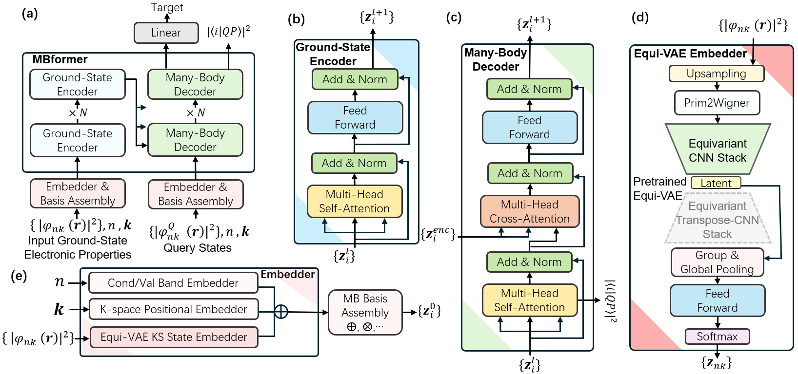
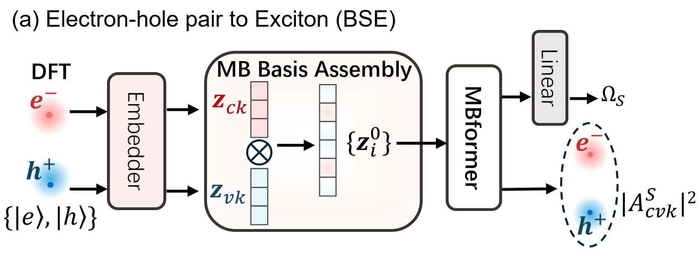
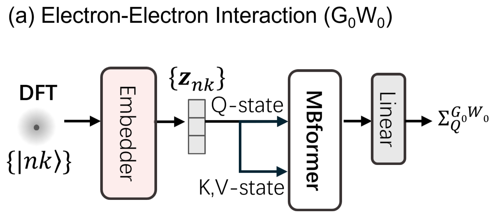

## Folder Structure
General workflow
```

Molecule Dynamncse─┐
      external src───(Collect)─>fp-input ──(QE/SIESTA/BGW + HPRO)─>─┌── ml-train-set──(ML)─> model
               ...─┘                                               └── ml-test-set
```
**Path 1** Tweisted-angle study of hBN
```

1. Train:
supercell.cif─(flow.py)─> MD─(md.py)─>fp-input─(flows.py)─> ml_dataset ──(deep-collect.py, deephe3-train.py)─> model

2. Use:
twist.cif───(deephe3-xx.py, diag_plot.py)─> band.png 
    model─┘
```

**Path 2** MBFormer for GW-BSE
```
--Path 2--:
1. Train:
external database─(collect.py)─>fp-input─(flows.py)─> ml_dataset ─(MBformer)─> model

Features: G0W0, BSE (binding energy, |<cvk|S>|)
```

model scheme:


GW scheme:


BSE scheme:


### TODO

- Xian: data.py (WFN task, Train VAE)
- Bowen: Transformer
- Jinyuan: 
                                           
### 1. **stru-input** folder
The stru-input folder contains the crystal structures
```bash
stru-input
├── fpconfig.json
├── mat-1 # (extensible)
|   └── stru.cif
├── mat-2
|   └── stru.cif
└── ...
```
### 1. **pp** folder
The pp folder contains all .upf and .psml for QE and SIESTA
```
pseudo_src/ # (built-in)
├── ele1.upf
├── ele2.upf
├── ...
├── ele1.psf/psml
├── ele2.psf/psml
└── ...
```

### 3. **flows** folder
```bash
flows/
├── mat-1
|   ├── config.json
|   ├── stru.cif
|   ├── pp/ # (built-in)
|   |   ├── ele1.upf
|   |   ├── ele2.upf
|   |   ├── ...
|   |   ├── ele1.psf/psml
|   |   ├── ele2.psf/psml
|   |   └── ...
|   ├──01-density
|   |   ├── VSC # (DFT Ham.)
|   |   └── ...
|   ├──02-wfn
|   ├──03-wfnq
|   ├──05-band
|   ├──06-wfnq-nns
|   ├──07-aobasis
|   |   ├── ele1.ion # (LCAO basis)
|   |   ├── ele2.ion
|   |   └── ...
|   ├──11-epsilon
|   ├──11-epsilon-nns
|   ├──13-sigma
|   |   ├── eqp1.dat # (G0W0 corr.)
|   |   └── ...
|   ├──14-inteqp
|   ├──16-reconstruction
|   |   ├──aohamiltonian
|   |   |   ├── element.dat
|   |   |   ├── hamiltonians.h5
|   |   |   ├── info.json
|   |   |   ├── lat.dat
|   |   |   ├── orbital_types.dat
|   |   |   ├── overlaps.h5
|   |   |   ├── rlat.dat
|   |   └── └── site_positions.dat
|   ├──17-wfn_fi
|   ├──18-kernel
|   └──19-absorption
├── mat-2
|   └──  ...
└── ...
```


### 4. **DeepH-E3** input folder

```
ml-train/test
├──graph_file (created by deep-preprocess.py)
├──ham1
|   ├── element.dat
|   ├── hamiltonians.h5
|   ├── info.json
|   ├── lat.dat
|   ├── orbital_types.dat
|   ├── overlaps.h5
|   ├── rlat.dat
|   └── site_positions.dat
├──ham2
|   └──  ...
└── ...
```

